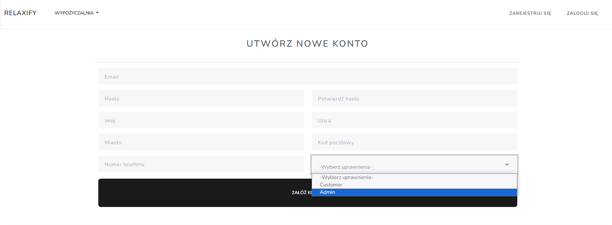
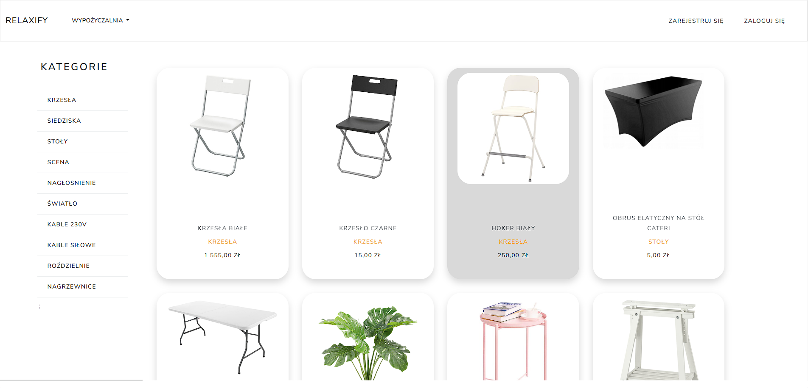
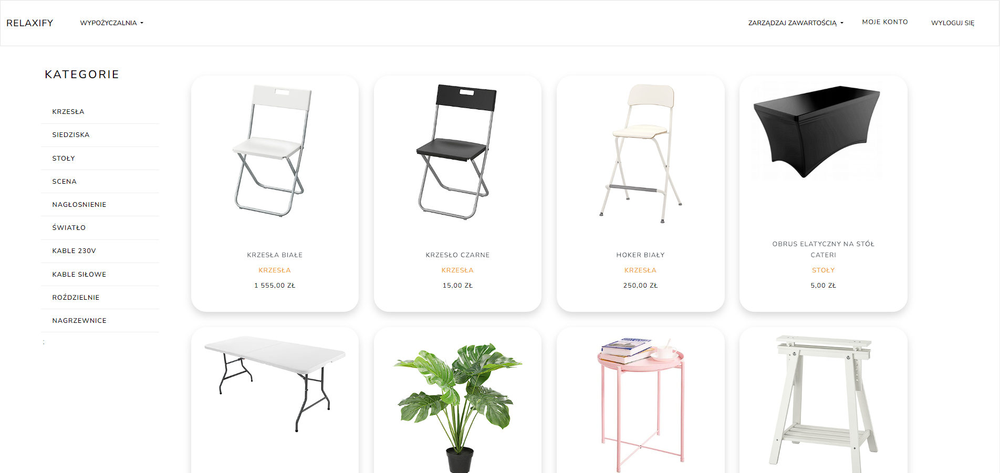
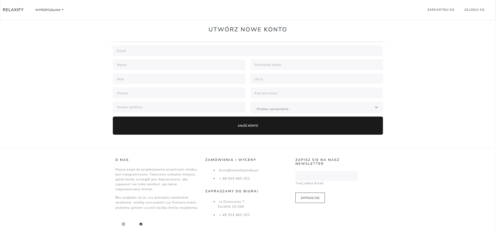
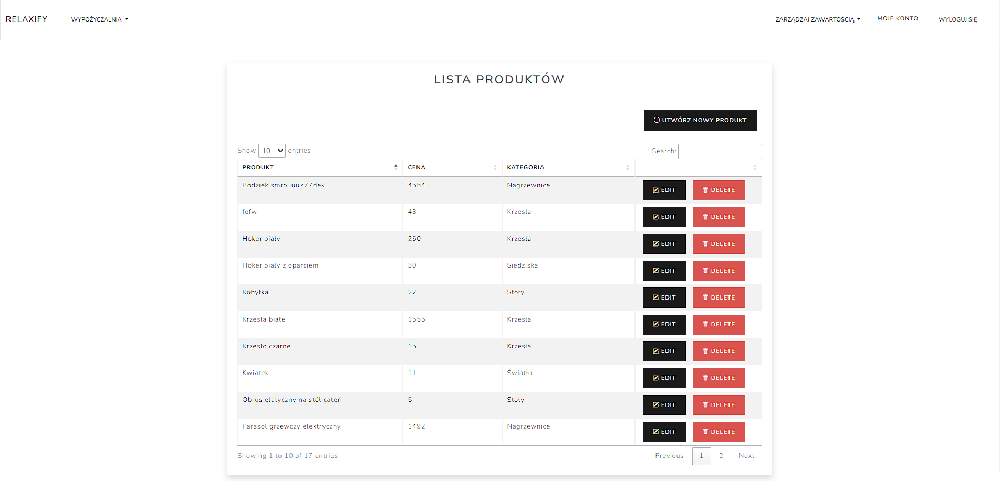
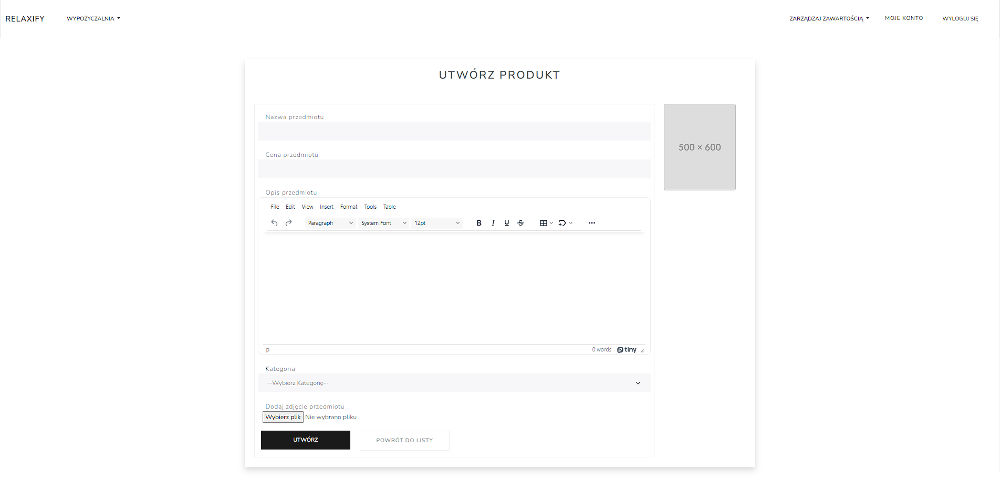

# Relaxify Web Application

> An application for renting event equipment. Displays all products available in stock (names, descriptions, photos). It allows administrators to easily manage all content on the website, i.e. add, modify, delete products or categories.

## General Information
- An application for presenting the assortment for rent.
- An event company can more easily reach a larger audience.
- A larger number of rental products.

## Technologies Used
- ASP.Net Core - version 8.0
- SqlServer - version 8.0
- EntityFrameworkCore - version 8.0
- Identity - version 8.0
- Azure

## Features
- creates new products and categories
- displays products by category
- module for logging in and registering new users divided into Client/Administrator roles

## Instalation
you don't need to install the application, you can find it below:

[https://relaxifyeventrentweb.azurewebsites.net/](https://relaxifyeventrentweb20240304182203.azurewebsites.net/)

when registering you can choose user type, click admin and then it will be available with full access to the site:
##

## Screenshots
### Basic view after entering the website

### Administrator view after logging in - a new tab for managing store content is visible

### New user registration view

### List of created products visible in the store

### View of creating a new product in the store

<!-- Optional -->
<!-- ## License -->
<!-- This project is open source and available under the [... License](). -->

<!-- You don't have to include all sections - just the one's relevant to your project -->
